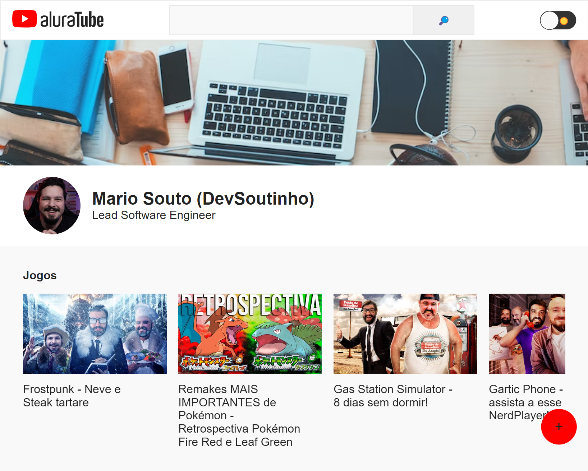

# AluraTube

## Projeto 💻
Projeto desenvolvido durante a Imersão React do Alura.

## Layout 🔖
Segue abaixo o layout deste projeto:
- [Figma](https://www.figma.com/file/1acrju7CLwHkSh6e7xEk9h/Aluratube?t=OJ2eMKroGbD0jo6r-6)

## Instalação 🛠
Siga esses passos para instalar o repositório na sua máquina:
1. Rode `git clone https://github.com/miishiyama/AluraTube` para fazer um clone desse repositório.
2. Rode `npm i` para instalar as dependências do projeto.
3. Rode `npm run dev` para iniciar o servidor de desenvolvimento.
4. Entre no link que aparecer no terminal.

## Tecnologias 🚀
As tecnologias utilizadas neste projeto são:
- JavaScript
- DOM
- Node
- NPM
- Supabase
- Next
- React
- React DOM
- Styled Components
- Media Queries

## Créditos ❤️
Feito por [Millene Eduarda Ishiyama](https://github.com/miishiyama/).
